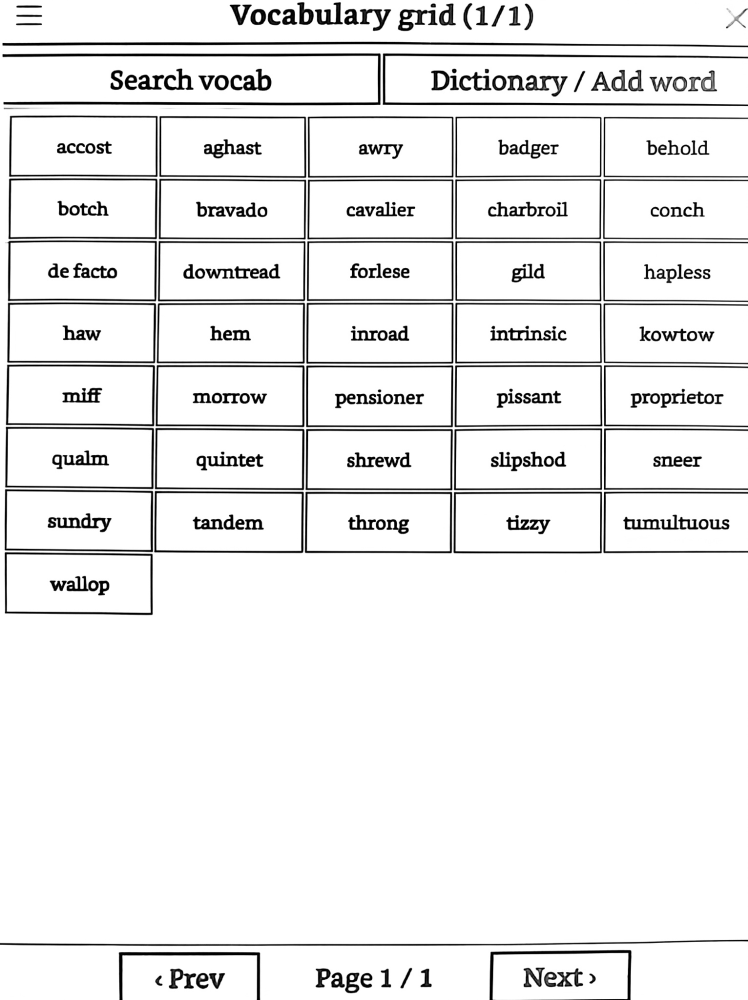

# vocabgrid.koplugin

A grid view for KOReader's built-in Vocabulary Builder. Shows your saved words in a configurable rows × columns grid instead of a list. Tap a word to open the normal dictionary lookup, with a button to remove it.

## Features

- Configurable grid layout (rows/columns), saved as your default
- Tap a word → opens KOReader's normal dictionary popup, with a "Remove vocabulary" button
- Search your current vocabulary list
- Look up and add new words straight from the grid
- Pagination for large vocab lists

## Install

1. Download the latest release zip
2. Extract it so you have a `vocabgrid.koplugin` folder
3. Copy that folder into `koreader/plugins/`
4. Restart KOReader
5. Enable it: **☰ → More tools → Plugin management → Vocabulary grid**
6. Open it from the main menu: **Vocabulary grid**

## Requirements

- KOReader with the Vocabulary Builder plugin enabled (this reads its existing database, doesn't replace it)

## Notes

This plugin reads/writes the same `vocabulary_builder.sqlite3` database as the stock Vocabulary Builder plugin — words you add or remove show up in both.
